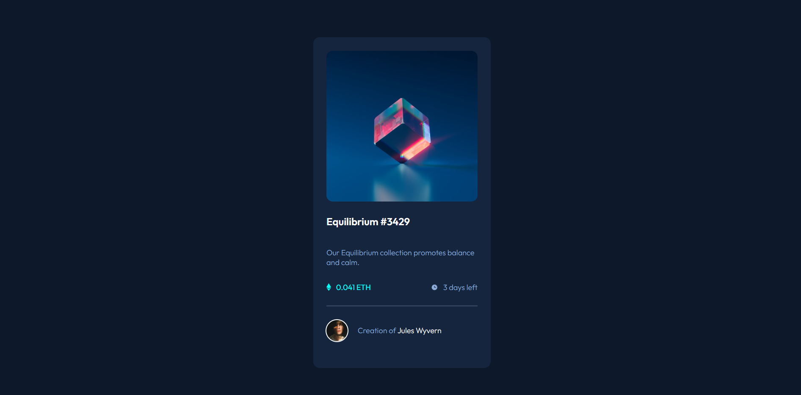

# Frontend Mentor - NFT preview card component solution

This is a solution to the [NFT preview card component challenge on Frontend Mentor](https://www.frontendmentor.io/challenges/nft-preview-card-component-SbdUL_w0U). Frontend Mentor challenges help you improve your coding skills by building realistic projects. 

## Table of contents

- [Overview](#overview)
  - [The challenge](#the-challenge)
  - [Screenshot](#screenshot)
  - [Links](#links)
- [My process](#my-process)
  - [Built with](#built-with)
  - [What I learned](#what-i-learned)
  - [Useful resources](#useful-resources)


## Overview

### The challenge

Users should be able to:

- View the optimal layout depending on their device's screen size
- See hover states for interactive elements

### Screenshot



### Links

- Solution URL: [Add solution URL here](https://github.com/krsng-lab/nft-preview-card)
- Live Site URL: [Add live site URL here](https://your-live-site-url.com)

## My process

### Built with

- Semantic HTML5 markup
- CSS 
- Flexbox

### What I learned

```html
  <div class="creator">Creation of <span style="color:hsl(0, 0%, 100%)">Jules Wyvern</span></div>
```

**Note: Delete this note and the content within this section and replace with your own plans for continued development.**

### Useful resources

- [Are you using the right CSS units?](https://www.youtube.com/watch?v=N5wpD9Ov_To&list=LL&index=4) - Useful video by Kevin Powell. Helps you to understand which CSS units to use.


